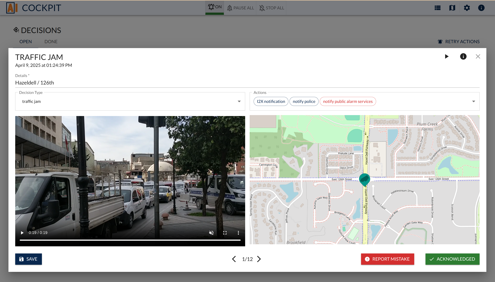
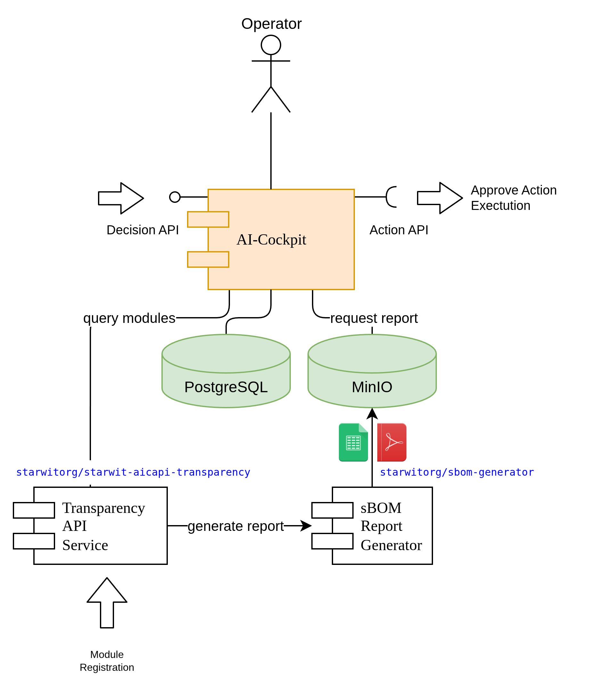
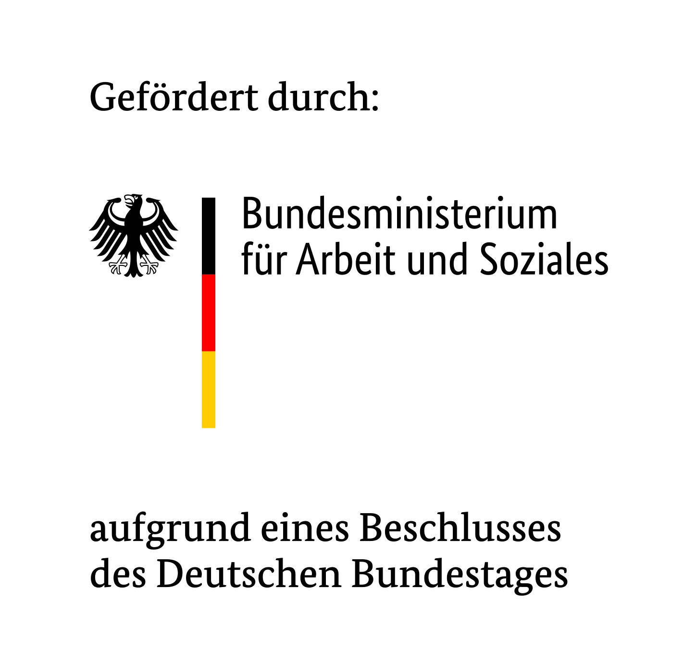

# AI Cockpit deployment

AI cockpit aims at building a human control interface to AI systems. It is supposed to cover requirements from EU's AI act. More details can be found at https://www.kicockpit.eu/. All shared components necessary for this repo can be found here. There you also can find more info about all other activities & results of this project.



This repository contains an overview of all necessary components as well as  tools to deploy all components of AI Cockpit. 

## Service Architecture
As AI Cockpit consist of multiple components, the following diagrom shows, how application components communicate.


## Component Breakdown
The components of Starwit's implementation of AI cockpit can be found in the following repositories:

| Component       | Repository / URI                                        | Description | Docker image | Helm Chart |
| ----------------| --------------------------------------------------------| ----------- | ------------ |----------- |
| AI Cockpit      | https://github.com/starwit/ai-cockpit                   | Actual Cockpit| [Link](https://hub.docker.com/r/starwitorg/ai-cockpit)   | [Link](https://hub.docker.com/r/starwitorg/ai-cockpit-chart) |
| Class library   | https://github.com/starwit/starwit-aic-api              | Data structures to use APIs | --   | --   |
| Transparency API| https://github.com/starwit/starwit-aic-transparency-api | API for transparency functions, holds module information| [Link](https://hub.docker.com/r/starwitorg/starwit-aicapi-transparency)   | [Link](https://hub.docker.com/r/starwitorg/starwit-aicapi-transparency-chart)   |
| sBOM Generator  | https://github.com/starwit/sbom-report-generator        | micro service to generate sbom reports| [Link](https://hub.docker.com/r/starwitorg/sbom-generator)   | [Link](https://hub.docker.com/r/starwitorg/sbom-generator-chart)   |
| Landing page    | https://github.com/starwit/ai-cockpit-landing-page      | Landing page for multiple cockpit deployments | --  | --  |
| AI Cockpit Runner |https://github.com/starwit/ai-cockpit-runner           | Windows app, that runs Cockpit with selected demo data | --   | --   |
| Alert viewer    | https://github.com/starwit/alert-viewer                 | Web app to display status of action executions | [Link]()   | [Link]()   |
| Action Executor | https://github.com/starwit/ai-cockpit-action-demo       | Sample action executor, including hardware triggering | [Link](https://hub.docker.com/r/starwitorg/ai-cockpit-action-demo)   | [Link](https://hub.docker.com/r/starwitorg/ai-cockpit-action-demo-chart)   |


# Deployment

Components can be deployed with two tools: Docker Compose and Helmfile. Docker Compose runs all components as Docker images and with Helmfile all components are deployed to a Kubernetes cluster.

The following diagram shows an overview of software components as well as a number of versioned artifacts.


## Docker Compose

Docker compose can be used to run a local setup of all components. Compose scripts are explained in detail [here](docker-compose/Readme.md)

TL;DR
```bash
    cd docker-compose
    export scenario=traffic
    sudo docker compose -f import-demo-docker-compose.yml up
```

## Helmfile
All components are shipped with a Helm chart. Helmfile is a tool to deploy multiple Helm charts. If you want to know more about Helmfile, see project page: https://helmfile.readthedocs.io/en/latest/

All helmfiles for this project can be found in folder [helmfiles](helmfile/README.md).

### Establish Environment

* get secrets from bitwarden:
   * get ssh public and private key
   * get kubeconfig
   * use env-template.sh and create env.sh and add it as source in your console
* use port forwarding to get connection to cluster, e.g.: `ssh -L 16443:localhost:6443 ai-cockpit`
* check that port forwarding is running e.g. with `kubectl get all --all-namespaces`

### Execute

With Helmfile you need a running Kubernetes cluster and your KUBECONFIG variable needs to point to an according config. If this is the case, the following command will install all components to namespace _aic_.
```bash
    cd helmfile
    helmfile diff helmfile.yaml -e aic-dev # check planned changes
    helmfile apply helmfile.yaml -e aic-dev 
```

### Connection to Database

* start pgadmin e.g. via docker compose script in your deployment project and add db connection:
    * get postgres credentials from kubernetes secrets
    * use port forwarding with ip 0.0.0.0 (e.g. via k9s) to be able to reach postgres port


## Contact & Contribution
The “KI-Cockpit” (AI Cockpit) project was funded by the Federal Ministry of Labor and Social Affairs and executed by the nexus Institute, Aalen University, the University of Stuttgart, Chemistree, Caritas Dortmund & Starwit Technologies with the support of Awesome Technologies Innovationslabor, the Institute for Innovation and Technology (iit) at VDI/VDE Innovation + Technik and keytec.



# License

Software in this repository is licensed under the AGPL-3.0 license. See [license agreement](LICENSE) for more details.